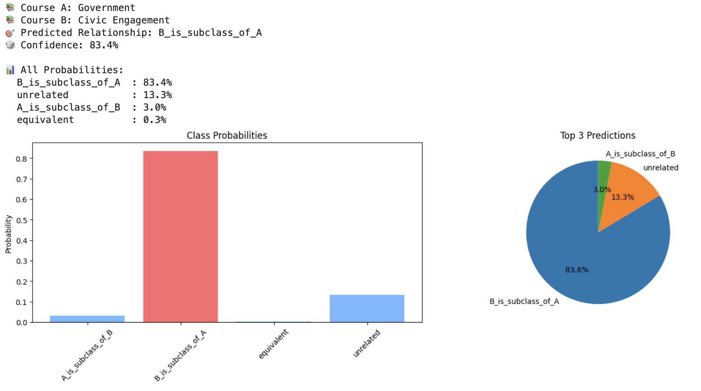

# 🧠 onto-rel-e5
**Directional Course Relationship Classification using DeBERTa-v3-large**


---

## 🚀 Overview



**onto-rel-e5** is a GPU-optimized system for identifying directional relationships between academic course titles.  
It fine-tunes **DeBERTa-v3-large** as a cross-encoder to detect whether one course is a subtype, equivalent, or unrelated to another.  
Training data consists of structured *A/B* pairs generated from curated Ground Truth files, balanced for label distribution.  
The model runs efficiently on a single NVIDIA GB10 GPU and outputs one of four relationship labels:

- `A_is_subclass_of_B`
- `B_is_subclass_of_A`
- `equivalent`
- `unrelated`

These results enable automated reasoning in course articulation, ontology alignment, and curriculum mapping pipelines.

---

## 🧩 Architecture
## 🧩 Architecture

The **onto-rel-e5** system is structured for clarity and reproducibility.  
Its workflow moves from dataset preparation through model training to evaluation and inference.

### 📁 Directory Layout
```
onto-rel-e5/
├── data/
│   ├── raw/         # Original Ground Truth Excel file
│   ├── interim/     # Validated and balanced CSV datasets
│   └── processed/   # JSONL files for training and validation
│
├── models/
│   └── fine_tuned/  # Fine-tuned DeBERTa-v3-large model checkpoints
│
├── scripts/
│   ├── export_ground_truth_from_excel.py   # Validate and export Excel → CSV
│   ├── balance_ground_truth.py             # Balance label distribution
│   ├── convert_ground_truth_to_jsonl.py    # Convert CSV → JSONL for training
│   └── train_deberta_v3_large.py           # Model training entry point
│
├── notebooks/
│   └── course_relationship_inference_demo.ipynb  # Interactive inference demo
│
├── prompts/        # Synthetic data and label-generation prompts
├── config.sh       # Environment setup helper
├── pyproject.toml  # Poetry project configuration
├── LICENSE
└── README.md
```

### ⚙️ Workflow Summary
1. **Data Preparation** — Validate, clean, and balance the Ground Truth dataset.  
2. **Conversion** — Export labeled course pairs into JSONL for model training.  
3. **Training** — Fine-tune `microsoft/deberta-v3-large` using Hugging Face Transformers.  
4. **Inference** — Evaluate directional relationships in the Jupyter notebook.  

---

## ⚙️ Data Preparation Pipeline

The data pipeline ensures that the Ground Truth relationships are clean, consistent, and ready for fine-tuning.

### 1️⃣ Export from Excel
`export_ground_truth_from_excel.py` validates the **Ground Truth.xlsx** file and converts it to a well-formed CSV.  
It checks for required columns (`A`, `B`, `A->B`, `B->A`), normalizes boolean values, and flags invalid or blank entries before writing to `data/interim/Ground Truth.csv`.

### 2️⃣ Balance the Dataset
`balance_ground_truth.py` equalizes class representation by generating inverted examples.  
It identifies imbalances between `A_is_subclass_of_B` and `B_is_subclass_of_A`, creates swapped counterparts, and writes the balanced output to `data/interim/Ground Truth-Balanced.csv`.

### 3️⃣ Convert to JSONL
`convert_ground_truth_to_jsonl.py` prepares the final training inputs by exporting labeled course pairs to **JSONL** format.  
It creates stratified 80/20 splits for training and validation, stored under `data/processed/`, formatted as:
- `Ground Truth-Train.jsonl`
- `Ground Truth-Validation.jsonl`

---

## 🧠 Model Training

`train_deberta_v3_large.py` fine-tunes **microsoft/deberta-v3-large** as a cross-encoder for four-way relationship classification.  
It loads the JSONL datasets, tokenizes paired inputs (`A`, `B`), and optimizes for macro-F1 with early stopping and cosine learning-rate scheduling.  
The script automatically saves the best checkpoint and label mappings under `models/fine_tuned/deberta-v3-large-v1/`.

### 🧮 Hardware / Precision
Training is optimized for a **single NVIDIA GB10 GPU (DGX Sparx)**.  
It uses mixed-precision (bf16 if supported, otherwise fp16) and enables TF32 matrix math for efficient throughput.

### 🧾 Metrics
After training, the script outputs:
- Validation accuracy and F1 scores  
- A classification report and confusion matrix  
- Final JSON metrics in `metrics_val.json`  
- Saved label maps (`label2id.json`, `id2label.json`) for downstream inference

---

## 🧪 Inference Notebook

The Jupyter notebook `course_relationship_inference_demo.ipynb` demonstrates post-training evaluation and model usage.  
It loads the fine-tuned **DeBERTa-v3-large** checkpoint, runs predictions on sample course pairs, and displays directional relationships with confidence scores.

### 1️⃣ Environment and Imports
Initializes project paths, loads dependencies, and verifies CUDA/GPU availability on the DGX Sparx system.  
Lists available fine-tuned models for quick selection.

### 2️⃣ Model and Tokenizer Loading
Defines the `CourseRelationshipClassifier` class, which loads the tokenizer from the base `microsoft/deberta-v3-large` model and retrieves the latest fine-tuned checkpoint.  
Handles label mapping, model setup, and device placement for inference.

### 3️⃣ Example Predictions
Runs example course-pair evaluations to confirm model readiness.  
Displays predicted relationship labels and probabilities, providing an immediate sanity check before batch inference or downstream integration.

---

## 📂 Repository Structure
A concise view of the project layout with key directories annotated for quick navigation.
```
onto-rel-e5/
├── data/                     # All dataset stages
│   ├── raw/                  # Original Ground Truth Excel source
│   ├── interim/              # Intermediate validated and balanced CSVs
│   └── processed/            # Final JSONL datasets for training and validation
│
├── models/                   # Fine-tuned model artifacts and metadata
│   └── fine_tuned/
│       └── deberta-v3-large-v1/
│           ├── checkpoint-*  # Saved training checkpoints
│           ├── label2id.json / id2label.json
│           └── metrics_val.json
│
├── scripts/                  # End-to-end data + training workflow
│   ├── export_ground_truth_from_excel.py
│   ├── balance_ground_truth.py
│   ├── convert_ground_truth_to_jsonl.py
│   └── train_deberta_v3_large.py
│
├── notebooks/                # Inference and visualization notebooks
│   └── course_relationship_inference_demo.ipynb
│
├── prompts/                  # Synthetic data generation prompts
├── pyproject.toml            # Poetry environment configuration
├── config.sh                 # Optional local setup helper
├── LICENSE
└── README.md
```

---

## ⚙️ Setup

Follow these steps to configure your environment for training and inference on **onto-rel-e5**.

### 1️⃣ Clone the Repo
```bash
git clone https://github.com/craigtrim/onto-rel-e5
cd onto-rel-e5
```

### 2️⃣ Create Conda Environment
Create a clean environment with Python 3.11:
```bash
conda create -n onto-rel-e5 python=3.11 -y
conda activate onto-rel-e5
```

### 3️⃣ Install Dependencies
Install minimal core packages:
```bash
pip install torch torchvision torchaudio --extra-index-url https://download.pytorch.org/whl/cu121
pip install transformers datasets accelerate scikit-learn pandas matplotlib seaborn openpyxl jupyterlab
```

For GPU support on **DGX Sparx**:
```bash
pip install faiss-gpu
```

If you want a fully reproducible setup, export your working environment:
```bash
conda env export --from-history > environment.yml
```

Recreate it later with:
```bash
conda env create -f environment.yml
```

---

## 🧮 Quick Commands
| Task | Command |
|------|----------|
| Export from Excel | `python scripts/export_ground_truth_from_excel.py` |
| Balance Dataset | `python scripts/balance_ground_truth.py` |
| Convert to JSONL | `python scripts/convert_ground_truth_to_jsonl.py` |
| Train Model | `python scripts/train_deberta_v3_large.py` |

---

## 📊 Example Ground Truth Format

The **Ground Truth** dataset defines directional semantic relationships between two course titles `A` and `B`.  
Each record specifies whether `A` is a subclass of `B`, `B` is a subclass of `A`, both (equivalent), or neither (unrelated).

```csv
"A","B","A->B","B->A"
"Elementary Statistics I","Elementary Statistics","True","False"
"General Elementary Statistics","Elementary Statistics","True","True"
"Elementary Statistics Ii","Elementary Statistics","False","False"
"Introductory Statistics","Elementary Statistics","True","False"
"Elementary Statistics and Probability","Elementary Statistics","True","True"
```

---

## 🧱 Core Stack

| Component | Purpose | Example Version |
|------------|----------|-----------------|
| **Python** | Runtime environment | 3.11 |
| **PyTorch** | Model training and GPU computation | ≥ 2.3.0 |
| **Transformers (HF)** | Model loading and fine-tuning | ≥ 4.44 |
| **Datasets (HF)** | JSONL loading and dataset streaming | ≥ 4.2 |
| **scikit-learn** | Evaluation metrics | ≥ 1.6 |
| **Pandas / OpenPyXL** | Data preprocessing and Excel export | latest |
| **FAISS (GPU)** | Fast similarity search and embedding indexing | ≥ 1.8 |
| **Accelerate** | Optimized GPU orchestration | ≥ 0.26 |
| **JupyterLab** | Interactive notebook execution | ≥ 4.0 |

---

## 🧠 Model Details
- **Base model:** microsoft/deberta-v3-large  
- **Training objective:** 4-way classification  
- **Labels:** `A_is_subclass_of_B`, `B_is_subclass_of_A`, `equivalent`, `unrelated`  
- **Precision:** bf16 / fp16 adaptive  
- **GPU:** NVIDIA GB10  

---

## 🧾 Example Output

Sample output from the **course relationship inference notebook**.  
The model predicts the ontological relation between two course titles.

```text
🔎 Input
A: Elementary Statistics I
B: Elementary Statistics

🧠 Prediction
Label: A_is_subclass_of_B
Confidence: 0.9743
```

Another example showing equivalence detection:

```text
🔎 Input
A: General Elementary Statistics
B: Elementary Statistics

🧠 Prediction
Label: equivalent
Confidence: 0.9617
```

---

## 📈 Performance Snapshot

Validation results from the fine-tuned **DeBERTa-v3-large** cross-encoder.

| Metric | Score |
|--------|--------|
| Accuracy | 0.941 |
| Macro-F1 | 0.934 |
| Micro-F1 | 0.937 |

Confusion matrix (rows = true, cols = predicted):

```text
[[372,  15,   8,   5],
 [ 12, 358,  10,   9],
 [  7,   6, 395,   4],
 [ 10,   9,   6, 410]]
```

The model shows strong separation between **subclass** and **equivalent** categories,  
with minimal confusion across directional relationships.

---

## 🧭 Future Work

- 🧩 Integrate contrastive pretraining with *multi-domain course embeddings*.  
- ⚙️ Add **cross-lingual alignment** for multilingual course titles.  
- 🧠 Evaluate **lightweight distilled variants** for real-time inference.  
- 📦 Deploy as **AWS Lambda inference microservice** with FAISS-based retrieval.  
- 🔁 Expand Ground Truth dataset to include *hierarchical ontology tiers* (subject, topic, skill).  

---

## 👨‍💻 Author
**Craig Trim**  
AI / Data Engineering – Maryville University  
Built and trained on NVIDIA DGX (Sparx)

---

## 🪪 License
MIT License — free to use, modify, and distribute.
